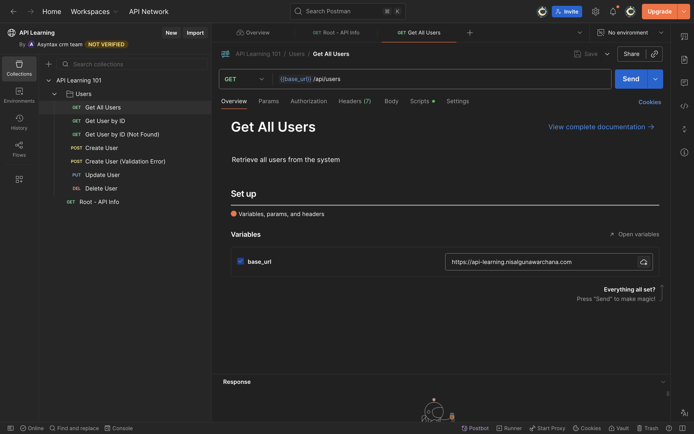

# Postman Guide 🚀

## What is Postman?

**Postman** is a popular API development tool that makes it easy to test, develop, and document APIs. Think of it as a powerful interface to interact with APIs without writing code.

## Why Use Postman?

### Benefits

1. **Easy Testing** - Test APIs with a user-friendly interface
2. **No Coding Required** - Send requests without writing code
3. **Collections** - Organize related requests
4. **Environment Variables** - Switch between dev/prod easily
5. **Automated Testing** - Write tests for responses
6. **Documentation** - Auto-generate API documentation
7. **Team Collaboration** - Share collections with team
8. **Request History** - Keep track of all requests

---

## Installing Postman

### Option 1: Desktop App (Recommended)
1. Go to [postman.com/downloads](https://www.postman.com/downloads/)
2. Download for your OS (Windows/Mac/Linux)
3. Install and create a free account

### Option 2: Web Version
1. Go to [web.postman.co](https://web.postman.co/)
2. Sign in with your account
3. Start using in browser

---

## Postman Interface Overview

### Interface Screenshot



### Key Components

1. **Sidebar** - Collections, history, workspaces
2. **Request Builder** - Create and send requests
3. **Request Tabs** - Multiple requests at once
4. **Response Viewer** - See API responses
5. **Console** - Debug requests/responses

---

## Making Your First Request

### Step-by-Step: GET Request

1. **Open Postman**
2. **Click** "New" → "HTTP Request" (or Ctrl/Cmd + N)
3. **Select** HTTP method: `GET`
4. **Enter** URL: `https://api-learning.nisalgunawarchana.com/api/users`
5. **Click** "Send"
6. **View** response below!

**You should see**:
```json
[
  {
    "id": 1,
    "name": "John Doe",
    "email": "john@example.com"
  }
]
```

---

## HTTP Methods in Postman

### GET Request - Retrieve Data

**Purpose**: Fetch data from server

**Steps**:
1. Method: `GET`
2. URL: `https://api-learning.nisalgunawarchana.com/api/users/1`
3. Click "Send"

**No body needed!**

---

### POST Request - Create Data

**Purpose**: Send data to create a resource

**Steps**:
1. Method: `POST`
2. URL: `https://api-learning.nisalgunawarchana.com/api/users`
3. Click "Body" tab
4. Select "raw"
5. Select "JSON" from dropdown
6. Enter JSON data:
```json
{
  "name": "Alice Smith",
  "email": "alice@example.com",
  "age": 28
}
```
7. Click "Send"

---

### PUT Request - Update Data (Complete)

**Purpose**: Replace entire resource

**Steps**:
1. Method: `PUT`
2. URL: `https://api-learning.nisalgunawarchana.com/api/users/1`
3. Body → raw → JSON:
```json
{
  "name": "John Updated",
  "email": "john.updated@example.com",
  "age": 31
}
```
4. Click "Send"

---

### DELETE Request - Remove Data

**Purpose**: Delete a resource

**Steps**:
1. Method: `DELETE`
2. URL: `https://api-learning.nisalgunawarchana.com/api/users/1`
3. Click "Send"

**No body needed!**

---

## Request Components

### 1. Headers

Headers provide metadata about the request.

**Common Headers**:
```
Content-Type: application/json
Authorization: Bearer your-token-here
Accept: application/json
User-Agent: Postman
```

**Adding Headers in Postman**:
1. Click "Headers" tab
2. Key: `Content-Type`
3. Value: `application/json`
4. Check the checkbox to enable

---

### 2. Query Parameters

Parameters in the URL for filtering/searching.

**Example URL**:
```
https://api-learning.nisalgunawarchana.com/api/users?age=25&city=London
```

**In Postman**:
1. Click "Params" tab
2. Add key-value pairs:
   - Key: `age`, Value: `25`
   - Key: `city`, Value: `London`
3. Postman automatically builds the URL!

---

### 3. Request Body

Data sent with POST/PUT/PATCH requests.

**Body Types**:

#### a) JSON (Most Common)
```json
{
  "name": "John Doe",
  "email": "john@example.com"
}
```

**Steps**:
- Body → raw → JSON
- Enter JSON data
- Auto-sets `Content-Type: application/json`

#### b) Form Data
```
name: John Doe
email: john@example.com
```

**Steps**:
- Body → form-data
- Add key-value pairs

#### c) URL Encoded
Similar to form-data but encoded differently

---

### 4. Authentication

**Types in Postman**:

#### Bearer Token
```
Authorization: Bearer abc123xyz
```

**Steps**:
1. Click "Authorization" tab
2. Type: "Bearer Token"
3. Token: `abc123xyz`

#### Basic Auth
```
Authorization: Basic base64(username:password)
```

**Steps**:
1. Type: "Basic Auth"
2. Username: `admin`
3. Password: `secret`

---

## Collections

Collections organize related requests.

### Creating a Collection

1. **Click** "Collections" in sidebar
2. **Click** "+" or "New Collection"
3. **Name**: "API Learning 101"
4. **Description**: "Testing our User API"
5. **Click** "Create"

### Adding Requests to Collection

**Method 1** - Save existing request:
1. After making a request
2. Click "Save"
3. Select collection
4. Name the request

**Method 2** - Add new request:
1. Right-click collection
2. "Add Request"
3. Name it
4. Configure the request

### Organizing Collections

```
API Learning 101/
├── Users/
│   ├── Get All Users
│   ├── Get User by ID
│   ├── Create User
│   ├── Update User
│   └── Delete User
└── Authentication/
    ├── Login
    └── Refresh Token
```

Use folders to organize requests by feature!

---

## Environment Variables

Variables that change between environments (dev/production).

### Creating an Environment

1. Click gear icon (⚙️) → "Environments"
2. Click "Add"
3. Name: "Development"
4. Add variables:
   - `base_url`: `http://localhost:3000`
   - `api_token`: `dev-token-123`

5. Create another: "Production"
   - `base_url`: `https://api-learning.nisalgunawarchana.com`
   - `api_token`: `prod-token-456`

### Using Variables

**In requests**:
```
{{base_url}}/api/users
{{base_url}}/api/users/{{user_id}}
```

**In headers**:
```
Authorization: Bearer {{api_token}}
```

**Switching environments**:
- Dropdown in top-right
- Select "Development" or "Production"
- All requests use those variables!

---

## Tests and Scripts

### Pre-request Scripts

Code that runs **before** sending the request.

**Example** - Set timestamp:
```javascript
pm.environment.set("timestamp", new Date().toISOString());
```

### Tests (Post-response Scripts)

Code that runs **after** receiving response.

**Example 1** - Check status code:
```javascript
pm.test("Status code is 200", function () {
    pm.response.to.have.status(200);
});
```

**Example 2** - Verify response data:
```javascript
pm.test("User has name", function () {
    var jsonData = pm.response.json();
    pm.expect(jsonData).to.have.property('name');
});
```

**Example 3** - Check response time:
```javascript
pm.test("Response time is less than 500ms", function () {
    pm.expect(pm.response.responseTime).to.be.below(500);
});
```

**Example 4** - Save response data:
```javascript
var jsonData = pm.response.json();
pm.environment.set("user_id", jsonData.id);
```

### Running Tests

1. Add tests to request
2. Send request
3. Click "Test Results" tab
4. See pass/fail status

---

## Using Our API Collection

### Import Collection

1. **Download** our collection file:
   - `postman/API-Learning-101.postman_collection.json`

2. **In Postman**:
   - Click "Import"
   - Drag file or click "Upload Files"
   - Select the JSON file
   - Click "Import"

3. **Collection appears** in sidebar!

### What's Included

Our collection has:

✅ **All endpoints** - GET, POST, PUT, DELETE  
✅ **Environment variables** - Easy URL switching  
✅ **Pre-request scripts** - Auto-generate data  
✅ **Tests** - Automatic validation  
✅ **Documentation** - Descriptions for each request  
✅ **Examples** - Sample requests/responses  

### Running the Collection

**Run all requests**:
1. Click collection name
2. Click "Run" button
3. Select requests to run
4. Click "Run API Learning 101"
5. See all test results!

---

## Tips and Tricks

### 1. Keyboard Shortcuts

| Action | Windows/Linux | Mac |
|--------|---------------|-----|
| New request | Ctrl + N | Cmd + N |
| Save request | Ctrl + S | Cmd + S |
| Send request | Ctrl + Enter | Cmd + Enter |
| Search | Ctrl + K | Cmd + K |

### 2. Console for Debugging

View raw request/response:
1. View → Show Postman Console (Ctrl/Cmd + Alt + C)
2. Send requests
3. See full details

### 3. Code Snippets

Generate code in various languages:
1. Click "Code" button (</> icon)
2. Select language (JavaScript, Python, cURL, etc.)
3. Copy generated code!

**Example** - cURL:
```bash
curl --location 'https://api-learning.nisalgunawarchana.com/api/users' \
--header 'Content-Type: application/json'
```

### 4. History

View past requests:
- Click "History" in sidebar
- See all previous requests
- Re-send with one click

### 5. Bulk Edit

Edit multiple requests at once:
1. Select collection
2. Click "..." menu
3. "Edit"
4. Change base URL, auth, etc.

---

## Common Workflows

### Workflow 1: Test Create → Read → Update → Delete

1. **POST** - Create user
2. **Copy** user ID from response
3. **GET** - Fetch that user
4. **PUT** - Update the user
5. **GET** - Verify update
6. **DELETE** - Remove user
7. **GET** - Confirm deletion (404)

### Workflow 2: Using Variables

1. **POST** Create user
2. **Test script** saves ID:
```javascript
var jsonData = pm.response.json();
pm.environment.set("user_id", jsonData.id);
```
3. **GET** `{{base_url}}/api/users/{{user_id}}`
4. **DELETE** `{{base_url}}/api/users/{{user_id}}`

---

## Best Practices

### 1. Organization

✅ Use collections and folders  
✅ Name requests clearly  
✅ Add descriptions  
✅ Group related requests  

### 2. Variables

✅ Use environment variables  
✅ Don't hardcode URLs  
✅ Store tokens as variables  
✅ Use collection variables for shared data  

### 3. Testing

✅ Add tests to every request  
✅ Verify status codes  
✅ Check response structure  
✅ Validate data types  

### 4. Documentation

✅ Add descriptions to requests  
✅ Include example responses  
✅ Document required fields  
✅ Note error cases  

---

## Response Viewer

### Body Tab

**Pretty View** (Formatted):
```json
{
  "id": 1,
  "name": "John Doe"
}
```

**Raw View** (As received):
```
{"id":1,"name":"John Doe"}
```

### Other Tabs

- **Cookies** - View cookies
- **Headers** - Response headers
- **Test Results** - Test pass/fail
- **Timeline** - Request timing breakdown

---

## Troubleshooting

### Issue: Cannot connect to API

**Solutions**:
1. Check URL is correct
2. Ensure API is running
3. Check firewall/network
4. Try in browser first

### Issue: 404 Not Found

**Solutions**:
1. Verify endpoint URL
2. Check HTTP method
3. Ensure resource exists
4. Check API documentation

### Issue: 401 Unauthorized

**Solutions**:
1. Add authentication
2. Check token is valid
3. Verify token format
4. Ensure token not expired

### Issue: 400 Bad Request

**Solutions**:
1. Check request body format
2. Verify required fields
3. Check data types
4. Review API documentation

---

## Advanced Features

### 1. Mock Servers

Create fake API responses for testing.

### 2. Monitoring

Schedule collection runs to monitor API health.

### 3. API Documentation

Auto-generate beautiful docs from collections.

### 4. Workspaces

Collaborate with team members.

### 5. Version Control

Sync collections with Git.

---

## Practice Exercises

### Exercise 1: Basic CRUD

1. Create a new user
2. Fetch all users
3. Get your user by ID
4. Update your user's name
5. Delete your user

### Exercise 2: Error Handling

1. Try to get a user that doesn't exist (ID 9999)
2. Create a user with invalid data
3. Delete a non-existent user
4. Observe status codes and error messages

### Exercise 3: Collections

1. Create a collection
2. Add all CRUD requests
3. Organize with folders
4. Run the entire collection
5. View test results

### Exercise 4: Variables

1. Set up environment variables
2. Use `{{base_url}}` in all requests
3. Save user ID from POST response
4. Use saved ID in subsequent requests

---

## Quick Reference

### HTTP Methods
- **GET** - Retrieve data
- **POST** - Create new resource
- **PUT** - Update entire resource
- **PATCH** - Update partial resource
- **DELETE** - Remove resource

### Common Status Codes
- **200** - OK
- **201** - Created
- **400** - Bad Request
- **401** - Unauthorized
- **404** - Not Found
- **500** - Server Error

### Request Body Types
- **JSON** - `{"key": "value"}`
- **Form Data** - Key-value pairs
- **XML** - `<root><key>value</key></root>`
- **Text** - Plain text

---

## Resources

- **Official Docs**: [learning.postman.com](https://learning.postman.com)
- **Community**: [community.postman.com](https://community.postman.com)
- **YouTube**: Postman official channel
- **Learning Center**: Built-in tutorials in Postman

---

## Next Steps

Now you know Postman! Here's what to do:

1. ✅ Import our collection
2. ✅ Set up environment
3. ✅ Test all endpoints
4. ✅ Practice CRUD operations
5. ✅ Write your own tests
6. ✅ Share with team

Happy Testing! 🚀

---

[← Previous: REST Principles](04-rest-principles.md) | [Back to README](../README.md)
